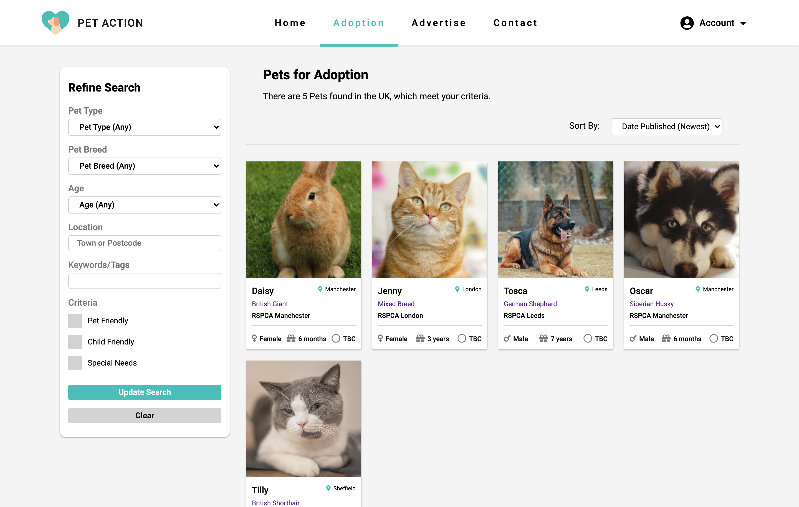

<div id="top"></div>

[![Contributors][contributors-shield]][contributors-url]
[![Forks][forks-shield]][forks-url]
[![Stargazers][stars-shield]][stars-url]
[![Issues][issues-shield]][issues-url]
[![MIT License][license-shield]][license-url]


<!-- PROJECT LOGO -->
<br />
<div align="center">
<h3 align="center">Pet Adoption Website</h3>

  <p align="center">
    Mobile responsive website for advertising and applying for pets that are for adoption.
    <br />
    <a href="https://github.com/cdcrawford97/Pet-Adoption-Website"><strong>Explore the docs »</strong></a>
    <br />
    <br />
    <a href="https://github.com/cdcrawford97/Pet-Adoption-Website">View Demo</a>
    ·
    <a href="https://github.com/cdcrawford97/Pet-Adoption-Website/issues">Report Bug</a>
    ·
    <a href="https://github.com/cdcrawford97/Pet-Adoption-Website/issues">Request Feature</a>
  </p>
</div>


<!-- TABLE OF CONTENTS -->
<details>
  <summary>Table of Contents</summary>
  <ol>
    <li>
      <a href="#about-the-project">About The Project</a>
      <ul>
        <li><a href="#built-with">Built With</a></li>
      </ul>
    </li>
    <li>
      <a href="#getting-started">Getting Started</a>
      <ul>
        <li><a href="#prerequisites">Prerequisites</a></li>
        <li><a href="#installation">Installation</a></li>
      </ul>
    </li>
    <li><a href="#roadmap">Roadmap</a></li>
    <li><a href="#contributing">Contributing</a></li>
    <li><a href="#license">License</a></li>
    <li><a href="#acknowledgments">Acknowledgments</a></li>
  </ol>
</details>


<!-- ABOUT THE PROJECT -->
## About The Project

<kbd>  </kbd>

The project was inspired by the real-world problem that every individual faces when wanting to quickly and easily adopt a pet, which is a lack of any modern app or website that would simplify the whole process to just a few clicks.

<b>Solution</b>:
* Pooling all local rescue animals into one app, the search process is simplified
* Allowing the user to set filters based on the animal and on their lifestyle
* Providing an intuitive and easy to use UI 

<p align="right">(<a href="#top">back to top</a>)</p>


### Built With

* [EJS](https://ejs.co/) - Javascript templating engine
* [Express](https://expressjs.com/) - The server for handling and routing HTTP requests
* [Mongoose](https://mongoosejs.com/docs/) - For modeling and mapping MongoDB data to Javascript
* [Passport](https://www.passportjs.org/) - For handling user authentication


<p align="right">(<a href="#top">back to top</a>)</p>


<!-- GETTING STARTED -->
## Getting Started

To get a local copy up and running follow these simple example steps.

### Prerequisites

Download the latest version of Node.js and npm
* npm
  ```sh
  npm install npm@latest -g
  ```

### Installation

1. Clone the repo
   ```sh
   git clone https://github.com/cdcrawford97/Pet-Adoption-Website.git
   ```
2. Install all required dependencies
   ```sh
   npm install
   ```
3. Create a .env file in the root directory

4. Enter your MongoDB connection string in `.env`
   ```sh
   DB_CONNECTION = ENTER YOUR CONNECTION STRING
   ```
5. Start local server
   ```sh
   npm start
   ```

<p align="right">(<a href="#top">back to top</a>)</p>


<!-- ROADMAP -->
## Roadmap

- [x] Add authentication
- [x] Add faceted search
- [x] Add pagination
- [x] Add comment section under adverts
- [ ] Add animal recommendation feature based on user location
- [ ] Add donation feature
- [ ] Add admin dashboard
    - [ ] adverts, users & comments
    - [ ] statistics


See the [open issues](https://github.com/cdcrawford97/Pet-Adoption-Website/issues) for a full list of proposed features (and known issues).

<p align="right">(<a href="#top">back to top</a>)</p>


<!-- CONTRIBUTING -->
## Contributing

Contributions are what make the open source community such an amazing place to learn, inspire, and create. Any contributions you make are **greatly appreciated**.

If you have a suggestion that would make this better, please fork the repo and create a pull request. You can also simply open an issue with the tag "enhancement".
Don't forget to give the project a star! Thanks again!

1. Fork the Project
2. Create your Feature Branch (`git checkout -b feature/AmazingFeature`)
3. Commit your Changes (`git commit -m 'Add some AmazingFeature'`)
4. Push to the Branch (`git push origin feature/AmazingFeature`)
5. Open a Pull Request

<p align="right">(<a href="#top">back to top</a>)</p>


<!-- LICENSE -->
## License

Distributed under the MIT License. See `LICENSE.txt` for more information.

<p align="right">(<a href="#top">back to top</a>)</p>


<!-- ACKNOWLEDGMENTS -->
## Acknowledgments

* [SwiperJS](https://swiperjs.com/) - Mobile touch slider library
* [Multer](https://www.npmjs.com/package/multer) - Middleware for handling multipart/form-data (uploading files to server)
* [bcryptJS](https://www.npmjs.com/package/bcryptjs) - Password hashing function library
* [Font Awesome](https://fontawesome.com/) - Free icon library

<p align="right">(<a href="#top">back to top</a>)</p>


<!-- MARKDOWN LINKS & IMAGES -->

[contributors-shield]: https://img.shields.io/github/contributors/cdcrawford97/Pet-Adoption-Website.svg?style=for-the-badge
[contributors-url]: https://github.com/cdcrawford97/Pet-Adoption-Website/graphs/contributors
[forks-shield]: https://img.shields.io/github/forks/cdcrawford97/Pet-Adoption-Website.svg?style=for-the-badge
[forks-url]: https://github.com/cdcrawford97/Pet-Adoption-Website/network/members
[stars-shield]: https://img.shields.io/github/stars/cdcrawford97/Pet-Adoption-Website.svg?style=for-the-badge
[stars-url]: https://github.com/cdcrawford97/Pet-Adoption-Website/stargazers
[issues-shield]: https://img.shields.io/github/issues/cdcrawford97/Pet-Adoption-Website.svg?style=for-the-badge
[issues-url]: https://github.com/cdcrawford97/Pet-Adoption-Website/issues
[license-shield]: https://img.shields.io/github/license/cdcrawford97/Pet-Adoption-Website.svg?style=for-the-badge
[license-url]: https://github.com/cdcrawford97/Pet-Adoption-Website/blob/master/LICENSE.txt
